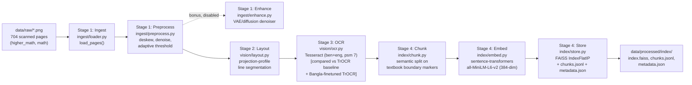

# Knowledge-base pipeline diagram (A2)

**Stages built for A2:** ingest → preprocess → layout → OCR → chunk → embed → store (Stages 0–4 of the spec).
**Changed from the default:** enhancement (VAE/diffusion) is bonus-tier and left disabled; OCR runs Tesseract
as the primary/reproduced baseline after comparing it against two TrOCR checkpoints (English-only and a
Bangla-finetuned model) on the same pages — Tesseract-on-lines gave the strongest output. Chunking uses a
semantic splitter keyed to Bangla textbook structure (chapters/examples/proofs/exercises) instead of plain
fixed-size windows. See `configs/design_choices.md` for the full per-stage justification.
